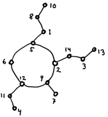

# The `spe` package &mdash; species lite

A simple library for combinatorial species with no dependencies but base.
For a quick taste, look at the examples below. For further information, see the
[reference documentation](http://hackage.haskell.org/package/spe)
on Hackage, and the full (but short!) source code:
[Math/Spe.hs](https://github.com/akc/spe/blob/master/Math/Spe.hs).

## Examples

### Octopodes



An octopus is a cycle of nonempty lists:
```haskell
oct = cyc `o` nonEmpty list
```

### Connected lists

A connected list is a nonempty list that begins with its smallest
element. E.g, `[3,5,9,7]` is connected but `[2,4,1]` is not. Using the
ordinal product we can define the L-species of connected lists by

```haskell
clist = x <*. list
```

in which `x` is the singleton species.  Let us print a few of these
connected lists to get a feeling for how this works:

```
> mapM_ print $ clist [2,5,6,9]
(2,[9,6,5])
(2,[9,5,6])
(2,[6,9,5])
(2,[6,5,9])
(2,[5,9,6])
(2,[5,6,9])
```

If we prefer to see these simply as lists rather than pairs, then we
would define

```haskell
clist = map (uncurry (:)) . (x <*. list)
```

Indeed, with this definition we have

```
> mapM_ print $ clist [2,5,6,9]
[2,9,6,5]
[2,9,5,6]
[2,6,9,5]
[2,6,5,9]
[2,5,9,6]
[2,5,6,9]
```

You might wonder why these lists are called "connected". It has to do
with the species `list` and `` set `o` listc `` being isomorphic. In
general, if `f` and `g` are species and `` f = set `o` g `` then `g` can
be seen as (connected) components of `f`, and those components may be
called connected `f`-structures.

### Binary trees

Here's an example of a recursively defined species.

```haskell
data BTree a = Empty | BNode a (BTree a) (BTree a) deriving (Show, Eq)

bTree :: Spe a (BTree a)
bTree [] = [ Empty ]
bTree xs = [ BNode v l r
           | (v,(l,r)) <- x .*. (bTree .*. bTree) $ xs
           ]
```

We could similary use the ordinal product to define increasing binary
trees, also called min-heaps:

```haskell
heap :: Spe a (BTree a)
heap [] = [ Empty ]
heap xs = [ BNode v l r
          | (v,(l,r)) <- x <*. (heap .*. heap) $ xs
          ]
```

### Derivatives

The following expression evaluates to true and illustrates that the
derivative of the species of cycles is isomorphic to the species of
lists (linear orders):

```haskell
(map catMaybes $ dx cyc [1..5]) == list [1..5]
```

### Ballot matrices

A ballot (or ordered set partition) is a list of blocks, where a block
is simply a nonempty set. We may give ballots this type:

```haskell
type Bal a = [[a]]
```

The ballot species can be defined by ``list `o` nonEmpty set``. The type
of this expression, ``Spe a ([[a]],[[a]])``, is, however, a bit more
complicated than we intended. Looking at the definition of partitional
composition in
[Math/Spe.hs](https://github.com/akc/spe/blob/master/Math/Spe.hs) we
realize that ``mapM (nonEmpty set) bs == bs`` for any set partition
`bs`. Thus the second component is redundant, and a better definition of
the species of ballots would be

```haskell
bal :: Spe a (Bal a)
bal = map fst . (list `o` nonEmpty set)
```

The species of ballots is already defined in
[Math/Spe.hs](https://github.com/akc/spe/blob/master/Math/Spe.hs).
The definition given there is a bit different for reasons of efficiency.

In a recent [preprint](http://arxiv.org/abs/1405.2441),
[Stuart Hannah](https://personal.cis.strath.ac.uk/stuart.a.hannah/) and I
study upper-triangular matrices of ballots without empty rows.
Those can be defined as follows:

```haskell
type Row a = [Bal a]
type BalMat a = [Row a]

rowOfLength :: Int -> Spe a (Row a)
rowOfLength i = bal .^ i

balMatOfDim :: Int -> Spe a (BalMat a)
balMatOfDim k = prod [ nonEmpty (rowOfLength i) | i <- [1..k] ]

balMat :: Spe a (BalMat a)
balMat xs = assemble [ balMatOfDim k | k <- [0..length xs] ] xs
```

Further, we define the sign of a ballot matrix by

```haskell
sign :: BalMat a -> Int
sign m = (-1)^(dim m + blk m)
  where
    dim = length                   -- Matrix dimension
    blk = length . concat . concat -- Total number of blocks
```

Let us count ballot matrices with respect to this sign:

```
> [ sum . map sign $ balMat [1..n] | n<-[0..6] ]
[1,1,3,19,207,3451,81663]
```

Looking up this sequence in [OEIS](http://oeis.org/), here using the
command line utility [`sloane`](https://github.com/akc/sloane), we find:

```
$ sloane 1,1,3,19,207,3451,81663

S A079144 1,1,3,19,207,3451,81663,2602699,107477247,5581680571,356046745023,
N A079144 Number of labeled interval orders on n elements: (2+2)-free posets.
```

In the aforementioned preprint we prove this surprising result using a
sign reversing involution.

# Notes

## Transport of structure

Assuming that `h . h' = h' . h = id`, we can define the transport of
structure as follows.

```haskell
transport :: Functor f => (a -> b) -> (b -> a) -> Spe a (f a) -> Spe b (f b)
transport h h' spe = map (fmap h) . spe . map h'
```

For this to work consistently we would, however, have to define some
additional newtypes and functor instances. For instance, in
`bal :: Spe a [[a]]` we would like `fmap` to map two levels deep instead
of one level deep in `[[a]]`.

## The `species` package by Brent Yorgey

This species module was created for use in my own research. It is
sufficient for my needs.  If you want something more substantial, then
you will most likely be happier with the excellent
[`species` package](http://hackage.haskell.org/package/species)
by Brent Yorgey.
